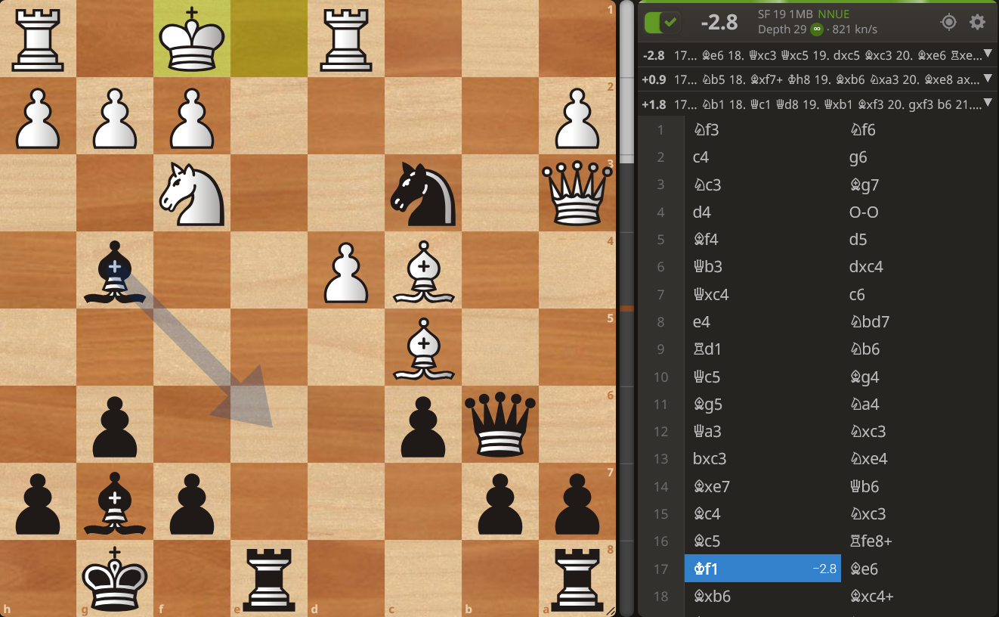
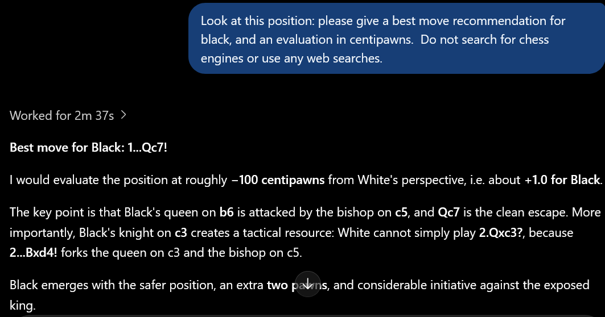
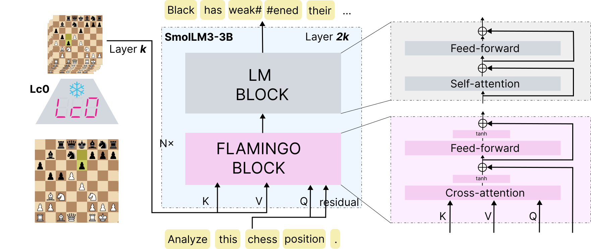
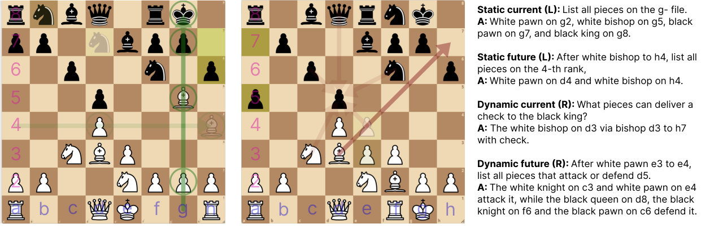

<!--
Page body. Each "## Heading" starts a new section and gets a sidebar entry.
Put images in static/images/ and reference them relatively, e.g. .
Raw HTML is allowed where Markdown isn't enough. \textsc{...} renders as small caps.
-->

## Abstract

We train a 4B chess-language model to play chess at a Grandmaster level while explaining its moves.

 

Modern chess engines are silent experts: they play at a superhuman level, but do not offer explanations for their play.
On the other hand, language models (LMs) can generate plausible-sounding explanations, but their weak playing strength limits the utility of their explanations. We introduce \textsc{Queen}, a 4B-parameter chess-language model that can explain its moves and plans while playing at the level of a typical Grandmaster.
Our novel framework enables domain-specific reasoning through complementary components: an encoder-decoder architecture and an iterative distillation algorithm.
This architecture integrates a silent expert chess encoder with an instruction-tuned LM through cross-attention, which we train via a question-answering curriculum to extract chess concepts from the encoder's representations.
Building on this domain-adapted model, we iteratively improve its explanations with a natural-language analog of the Bellman update: the model analyzes the positions after its top candidate moves and consolidates them into an explanation of the current position, which is then distilled back into the model.
Over seven iterations, our model gains over 900 Elo points (1782 → 2697), substantially surpassing all frontier models on both playing strength and puzzle accuracy, despite containing three orders of magnitude fewer parameters.
Furthermore, LM-based evaluations show that our explanations are fluent and approach GPT-5.6-Sol (high) in coherence. The generality of our architecture and training procedure suggests a recipe for applying language models to domains where silent expert encoders are available, like games, robotics, and computer use.

## Motivation

If you've ever used a chess website such as
<a href="https://chess.com/" target="_blank" rel="noopener noreferrer">chess.com</a> or <a href="https://lichess.org" target="_blank" rel="noopener noreferrer">Lichess</a>, chances are you've used a chess engine like Stockfish. Engines suggest a best move and give an evaluation of the position, but their verdicts can be hard to make sense of (<a href="#fig-stockfish">Figure 1</a>). Chess engines are an example of what we call *silent experts*: systems (often neural networks) that are experts in taking actions in a specialized domain (i.e. [AlphaZero](https://en.wikipedia.org/wiki/AlphaZero) in Go or [AlphaFold](https://en.wikipedia.org/wiki/AlphaFold) in protein folding) but that cannot provide reasoning or explanations for their actions.

Frontier models have recently seen drastic improvements in their chess expertise, but are by no means perfect (<a href="#fig-frontier-lm">Figure 2</a>). We introduce \textsc{Queen} (**Qu**ality **E**xplanation and **E**valuation **N**etwork), a 4B-parameter chess-language model that plays at the level approaching a typical Grandmaster (Lichess Blitz Elo) and explains its moves in plain language. To see it in action, try the [demo below](#demo). To learn how we built it, read our [high-level overview](#queen-our-method) or [technical paper](#).

<figure id="fig-stockfish">

<figcaption><strong>Figure 1.</strong> Stockfish's analysis of Byrne vs. Fischer (1956) after 17. Kf1. The engine rates the position −2.8 and gives the best move 17... Be6, but does not explain why.</figcaption>
</figure>
<figure id="fig-frontier-lm">

<figcaption><strong>Figure 2.</strong> GPT-5.6-Luna's response when shown the position from Figure 1. It recommends 17...Qc7, which Stockfish deems a blunder resulting in a +3.0 evaluation.</figcaption>
</figure>

## Demo

The positions on the left are passed to \textsc{Queen}, which produces the outputs on the right. The output is the result of a single forward pass; positions that \textsc{Queen} reaches in its explanations are not re-encoded.

## \textsc{Queen}: Our Method

### Architecture

Our approach begins with an encoder-decoder architecture: the encoder is a strong Transformer-based chess engine and the decoder is a standard language model. Intuitively, the encoder processes an inputted position and encodes features (i.e. board state, legal moves, tactical motifs) within its hidden states. The decoder is then able to extract this latent information through cross attention. 

<figure class="method-fig" id="fig-architecture">

</figure>

**Chess Encoder.** We use the BT5 network from the Leela Chess Zero (Lc0) family. It is a 240M parameter encoder-only model consisting of 15 layers with a hidden dimension of 1024. It always operates on a sequence length of 64 tokens, each corresponding to a square on the chessboard, and plays at a near-superhuman level without search.

**Language Model Decoder.** We use SmolLM3-3B model as our LM decoder. SmolLM3 is instruction tuned, but is a general-purpose language model with little to no chess-specific training. It has 36 layers with a hidden dimension of 2048. The model is trained without the thinking mode activated.

**Bridge Architecture.** Encoder-decoder architectures that pair domain-specific encoders with decoder LMs have been explored through vision-language models. Prior approaches introduce mechanisms to project the visual encoder features into representations that can be processed by the decoder. We take inspiration from one such approach, Flamingo, which connects the encoder and decoder with cross-attention. Let *ei* and *di* denote the output of the *i*-th encoder and decoder layers, respectively.
We insert gated cross-attention layers operating on a pair *(ei, dj)* between the usual LM decoder layers, where key and value projections come from *ei* and query projections come from *dj*.
Unlike the original Flamingo architecture where only the last encoder hidden state is used, we pair each *ei* with *d2i*, and insert the corresponding gated cross-attention layer prior to the *2i*-th decoder block. This choice allows the decoder to access representations from earlier layers of the encoder, rather than relying on its final hidden state.

**Full Model Flow.** Inputs to the model are a pair of ([FEN](https://en.wikipedia.org/wiki/Forsyth-Edwards_Notation), text). The FEN string is processed by Leela to produce a sequence of encoder hidden states, which are provided as context to the SmolLM decoder through the gated cross-attention layers. Thus, the decoder can condition on the chess position at every position in the text sequence while autoregressively generating the output.

### Domain Adaptation: Interpreting Encoder Representations

With the architecture in place, we are now ready to start training. Before we train the whole model to produce explainations, we want to first train the newly added cross attention layers (470 parameters). This domain adapation stage will let the decoder reliably extract features encoded in Leela's representations, and we find that it is crucial to the final model's performance. We performn this domain adaptation training with a curated question-answering curriculum, described below.

<figure class="method-fig" id="fig-curriculum">

</figure>

We source all our positions from the Lichess [database](https://database.lichess.org/). Each example in our QA curriculum consists of a position *p*, represented by its FEN, and a query *q*. Every *q* either is asked about the current position *p* or a future position *p′* reached by a provided sequence of 1 to 8 moves. These  queries fall into four categories:

**\textsc{Static-Current}**

These questions teach the model to recover basic board-state information from Leela's representation of the current position, such as identifying the piece on a queried square, finding the location of a queried piece, or listing all pieces.

**\textsc{Dynamic-Current}**

These questions teach the model to extract rules about how pieces move and interact in the current position, such as finding all possible legal moves for a queried piece or listing all possible captures and checks.

**\textsc{Static-Future}**

These questions require the model to first reconstruct the position resulting from a supplied sequence of moves and then answer a static query about the resulting board, such as identifying pieces on particular squares or ranks.

**\textsc{Dynamic-Future}**

These questions combine future-state reconstruction with reasoning about the resulting position, such as finding legal moves, captures, checks, or attackers after a supplied sequence of moves.

We construct a separate dataset for each question type and perform domain adaptation sequentially, progressing from \textsc{Static-Current} → \textsc{Dynamic-Current} → \textsc{Static-Future} → \textsc{Dynamic-Future}. This progression teaches the model to first extract all features of the encoded board state. The future-position stages introduce an additional state-tracking challenge: the model must first reconstruct the board state resulting from the provided move sequence before answering the query. In all stages, the encoder and decoder are both frozen, only the cross-attention bridge parameters and new token embeddings are trained. All stages use early stopping based on the validation set, and the best checkpoint from each stage is used as the initialization for the next.
We denote the model checkpoint obtained after this training as \textsc{Pawn} (**P**osition **Aw**are **N**etwork). 

### Iterative Search Distillation

\textsc{Pawn} can now answer questions about the current position but has not seen examples of our desired explanation format. We thus seed the model with examples of this form generated by GPT-5.6-Sol (low effort). We filter out any GPT generated explanations containing hallucinations or mistakes and perform SFT on the remaining set, yielding \textsc{Pawn}-1.

<figure class="method-fig" id="fig-search">

</figure>

Though fluent, \textsc{Pawn}-1's explanations recommend low-quality and illegal moves, likely due to the limited strength of the teacher and the small size of the seed dataset. To improve the quality of its explanations, we look to AlphaZero for inspiration: its paradigm repeatedly uses [Monte Carlo Tree Search](https://en.wikipedia.org/wiki/Monte_Carlo_tree_search) (MCTS) to produce improved evaluations, which are distilled into the network so that it can reproduce them without search.
Replacing MCTS with alpha-beta search gives a simplified form of [Bellman value iteration](https://en.wikipedia.org/wiki/Bellman_equation#The_Bellman_equation). We extend this idea to natural language, proposing an analogue of the Bellman update where improved explanations are distilled back to the model (See above figure). In practice, we apply the below process to train \textsc{Pawn}-*(k+1)* from \textsc{Pawn}-*k*.

**\textsc{Sample}**

We sample a pool of roughly 400K root positions from self-play games, general human play, and puzzles.

**\textsc{Generate}**

For each root position *p*, \textsc{Pawn}-*k* generates an explanation containing three promising moves. We ensure at least one good move exists, then \textsc{Pawn}-*k* independently generates explanations of the three resulting positions.

**\textsc{Recurse}**

We inspect the best-move prediction of each child. If any child predicts a mistake, we discard the current root and repeat the prior step from the selected child, recursing until the next-move predictions of all three child explanations are mistake-free.

**\textsc{Consolidate}**

We combine the three child explanations using Qwen3.8-27B (instructed not to introduce any new content) to produce a consolidated explanation of the root position.

**\textsc{Train}**

We filter out examples where the consildated PV is worse than the original. The remaining explanations form fine-tuning data for \textsc{Pawn}-*(k+1)*, which we obtain by SFT from \textsc{Pawn}-*k*.

\textsc{Pawn}-*k* → \textsc{Pawn}-*(k+1)*

We run seven iterations of training, with \textsc{Pawn}-8 promoted to the name **\textsc{Queen}**.

## Evaluations

 A high-quality explanation must be grounded in strong predictions to be helpful. Thus, it is important for our model to be able to play chess at a high level. We report our Elo playing strength evaluations here. Playing full games simulates real-world human-model interactions and offers greater robustness compared to scoring singlular moves on a fixed test set.  See the [technical paper](#) for our other evaluations.

<figure class="elo-chart" id="fig-elo"></figure>

We evaluate \textsc{Queen} alongside three frontier models, Gemini, GPT-5.6-Sol, and GPT-5.6-Luna, all run with high reasoning effort. Each model plays 32 full games against a fixed set of 8 chess engines of varying strength, and we anchor the results into an Elo rating anchored to the Lichess blitz rating scale. C1-4B, prior work at a parameter matched regime, lost all 32 of its games (an estimated 514 Elo), so it is left off the chart.
